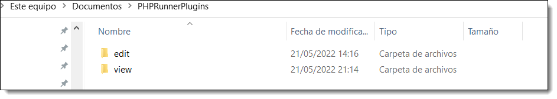
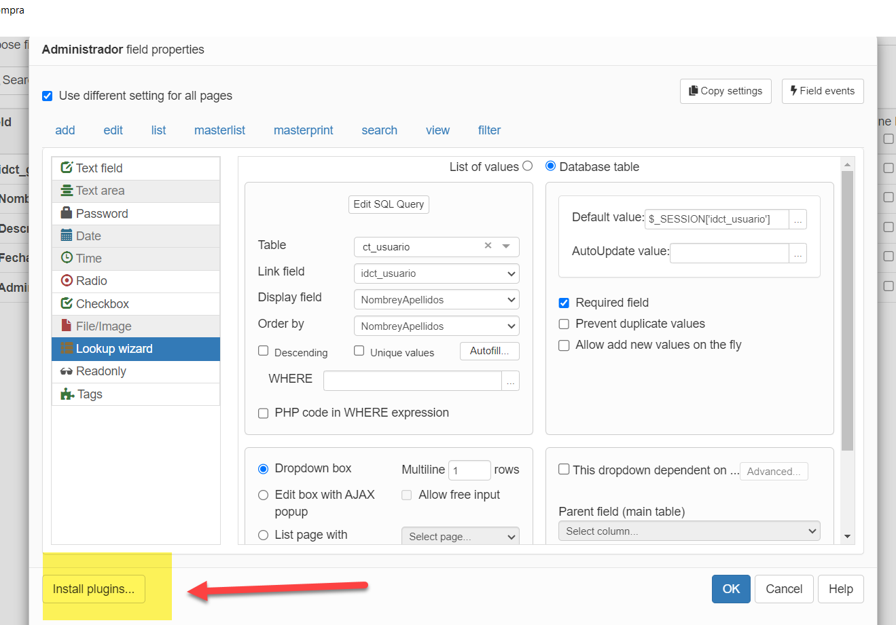
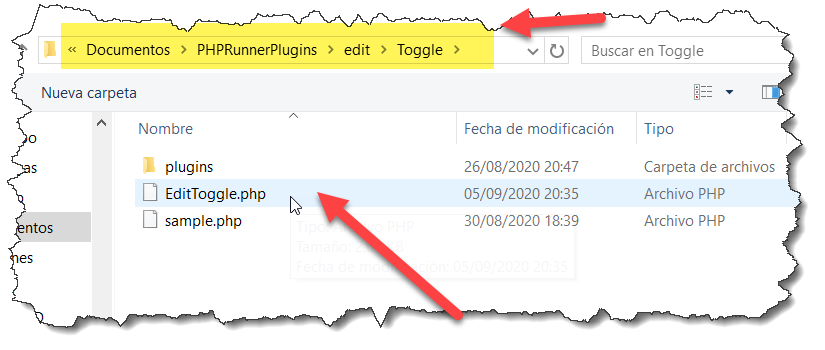

# phprunner-plugin

Plugins for PHPRunner

Es prácticamente seguro que mi Blog [https://fhumanes.com](https://fhumanes.com) va a desaparecer y quiero que algunos artículos del mismo se conserven para que los usuarios que lo utilicen puedan seguir utilizándolos y evolucionándolos, por ello he creado este repositorio de GITHUB.

**Estos Plugins sólo sirven para ser utilizados en PHPRunner**, que es un producto comercial de Xlinesoft.

En este momento, voy a realizar una explicación pequeña.

- - -

# Plugins de PHPRunner no propios

| Nombre           | Descripción                                                                                                                                                                                                                                                                                                    |
| ---------------- | -------------------------------------------------------------------------------------------------------------------------------------------------------------------------------------------------------------------------------------------------------------------------------------------------------------- |
| **Colors**       | Selector de un color en hexadecimal, para utilizar posteriormente para señalar un objeto.                                                                                                                                                                                                                      |
| **Timmy**        | Selector de fecha y/o tiempo. Muy vistoso y muy ágil.                                                                                                                                                                                                                                                          |
| **SignaturePad** | Poder hacer grafismo de firma manuscrita para poderla utilizar como soporte de firma. Actualmente, vemos que todas las empresas de transportes utilizan este tipo de firma para verificar que la entrega está hecha.                                                                                           |
| **Telegramia**   | Para los campos Memos, nos permite controlar el número de letras y/o palabras que se deben y pueden introducir, informando en cada caso al usuario. También puedes controlar el número de líneas que el usuario marca. Muy aconsejable si el texto se va a utilizar para generar documentos Word, Excel o PDF. |
| **Mapy**         | No funciona en versión 10.4. Su funcionalidad se ha integrado en PHPRunner sin necesidad de plugin.                                                                                                                                                                                                            |
| **Docky**        | No funciona en versión 10.4. Si se requiere visualizar documento en la web visitar artículo https://jonathancamp.com/2018/07/31/embed-google-docs-document-within-your-web-page/   El problema de seguridad es que todos estos documentos se están trasladando a Google para que su servicio lo visualice.     |
| **TimePiker**    | Nos sirve para introducir la hora, minuto y segundo. No es muy práctico.                                                                                                                                                                                                                                       |
| **Star Rating**  | Muy bueno para que los usuarios hagan una clasificación de la información.                                                                                                                                                                                                                                     |
| **Slider**       | Es una barra de desplazamiento para la introducción de un número. Especial para el móvil.                                                                                                                                                                                                                      |
| **Spinner**      | Son flechas de desplazamiento para la introducción de un número. Especial para móvil.                                                                                                                                                                                                                          |
| **Almanac**      | Espectacular calendario (sólo día, mes y año). Especial para móvil.                                                                                                                                                                                                                                            |
| **QR**           | Presentación de gráficos 2D en formato QR del valor del campo. Especial para móvil y documentos a presentar a terceros.                                                                                                                                                                                        |
| **Knob**         | Gráfico muy atractivo, para introducir un número o presentarlo. Especial para móvil.                                                                                                                                                                                                                           |
| **EditTag**      | Para introducir etiquetas de clasificación (similar a las que se utilizan en CMS).                                                                                                                                                                                                                             |
| **Arbol**        | Para seleccionar uno o varios valores de una estructura jerárquica (árbol). Una solución excelente.                                                                                                                                                                                                            |
| **Gestury**      | Para introducir o validar una clave utilizando el mismo interfaz que utilizan los móviles. Muy bueno para aplicaciones móviles.                                                                                                                                                                                |
| **Security**     | Para introducir una password con ayuda de si cumple o no las condiciones. Muy buena. Facilita la renovación de password a los usuarios.                                                                                                                                                                        |
| **Multiselect**  | Un práctico control para seleccionar múltiples claves de un catálogo. No es práctico si el número de valores es muy grande. Si puede ser útil para móvil.                                                                                                                                                      |

# Plugins de PHPRunner propios

| Nombre                  | Descripción                                                                                                                                                                                                                                                                                                                                                                                                                               |
| ----------------------- | ----------------------------------------------------------------------------------------------------------------------------------------------------------------------------------------------------------------------------------------------------------------------------------------------------------------------------------------------------------------------------------------------------------------------------------------- |
| **RangeDatePicker**     | Un práctico calendario para recoger fecha inicial y fecha final. Es muy habitual para reservas de viajes, definición de actividades, etc.                                                                                                                                                                                                                                                                                                 |
| **HijriDatePicker**     | Un calendario para los países Árabes (Hijri). Tiene dual formato de fecha  Hijri y Gregoriano (solicitado por Ali Alghanim)                                                                                                                                                                                                                                                                                                               |
| **Telephone**           | Una ayuda para la codificación de los países en los números de teléfonos. (Solicitado por Keith and Nancy Howard)                                                                                                                                                                                                                                                                                                                         |
| **Geolocation**         | A través del Api del Navegador, obtiene la latitud y longitud de donde esté el PC o móvil. Especial para móvil.                                                                                                                                                                                                                                                                                                                           |
| **Toggle**              | Un plugin visual para activar y desactivar valores. Valor activo = 1. Especial para móvil.                                                                                                                                                                                                                                                                                                                                                |
| **Select2**             | Lookup con etapa de búsqueda que mejora mucho el interfaz para desplegables de muchos valores. Selección uno o múltiples valores. Mejoras: – Multi idioma – Posibilidad de incluir imágenes en lista de opciones                                                                                                                                                                                                              |
| **Multiselect2**        | Lookup múltiple. Es una corrección del plugin Multiselect en el que se han hecho los siguientes cambios: – Nuevos parámetros para fijar al altura y ancho del plugin. – Cambios en CSS, para hacerlo más fácil de leer sus características                                                                                                                                                                                        |
| **TreeJson**            | Visualización de forma gráfica de la estructura de un fichero JSON.Este plugin está creado para mi compañero y amigo Raúl Plaza                                                                                                                                                                                                                                                                                                           |
| **AnyChart**            | Una forma de explotar, de forma sencilla y rápida, el potencial gráficos del producto AnyChart.                                                                                                                                                                                                                                                                                                                                           |
| **Emoji**               | Para poder introducir Emoji en los campos de texto. Especialmente útil para los comentarios que podamos hacer o nos hagan, en nuestras aplicaciones.                                                                                                                                                                                                                                                                                      |
| **Markdown**            | Es un editor que utiliza el lenguaje «markdown» para almacenar los contenidos. Es muy sencillo su uso y su contenido es muy más simple que utilizar directamente HTML.                                                                                                                                                                                                                                                                    |
| **Summernote**          | Es un editor que utiliza el lenguaje «HTML» para almacenar los contenidos. Es muy sencillo su uso, incorpora Emoji y es personalizable los botones y puede configurarse en un conjunto grandes de idiomas.                                                                                                                                                                                                                                |
| **Calculator**          | Es una utilidad muy curiosa, pues permite disponer de una calculadora para informar de un valor numérico. La idea original y parte del código es de www.intexpublishing.com  ¡gracias Martin!!!                                                                                                                                                                                                                                   |
| **Trumbowyg**           | Es un editor que utiliza el lenguaje «HTML» para almacenar los contenidos. Es muy rápido y sencillo su uso. Es personalizable los botones y puede configurarse en un conjunto grandes de idiomas. Dispone de muchos plugins, algunos de ellos se han incorporado. La idea original y parte del código es de www.intexpublishing.com  ¡gracias Martin!!!                                                                           |
| **Switch**              | Es un checkbox que simula un interruptor con diversos tamaños y colores. Es ideal para utilizar en aplicaciones que vayan a correr en el móvil.                                                                                                                                                                                                                                                                                           |
| **Codemirror**          | Es un Text Área en donde se puede incluir código PHP (HTML,XML,CSS y JavaScript) y colorea las sentencias.                                                                                                                                                                                                                                                                                                                                |
| **BootstrapDataPicker** | Es un selector de fechas con muchas funcionalidades. Se pueden establecer días no hábiles (no seleccionables)                                                                                                                                                                                                                                                                                                                             |
| **TouchSpin**           | Es un incrementador/decrementador de valores  a través dos botones . Es especial para aplicaciones de móviles                                                                                                                                                                                                                                                                                                                             |
| **Tags**                | Es la posibilidad de incluir varias etiquetas en un único campo. Las posibles etiquetas pueden ser de una lista cerrada o una lista abierta. Muy buena solución para la clasificación del contenido por múltiples criterios.                                                                                                                                                                                                              |
| **Select2_ajax**        | Lookup con etapa de búsqueda que mejora mucho el interfaz para desplegables de muchos valores. Hacen el acceso a los datos a través de Ajax, en el momento del diálogo. Selección uno o múltiples valores Mejoras: – Multi idioma – Posibilidad de incluir dependencia con otros campos – Optimización para tablas muy grandes (limitación de registros recuperados) – Filtro/búsqueda en gestor de base de datos |
| **Sqlcodemirror5**      | Este plugin sirve para «colorear» una sintaxis de SQL, es decir, para resaltar las palabras de una sentencia de SQL. Internamente utiliza CodeMirror 5. !Gracias Rubén!!!                                                                                                                                                                                                                                                             |

### Instalar en versiones PHPRunner 10 o anteriores

Los plugins se instalan fuera de los directorios donde se instala el 
producto PHPRunner, ya que las diferentes versiones y builds, podrían 
machar dicha instalación y porque los plugins son comunes (sirven) para 
todas las versiones de PHPRunner que tengas instaladas en tu PC.

Los plugin se instalan por usuario del PC,  en su directorio 
«Documentos» el producto ha creado una serie de directorios y en 
concreto ha creado el directorio «PHPRunnerPlugins»

Debajo de ese directorio deben existir los directorios «view» y «edit», 
que corresponden a los 2 tipos de plugins que vamos a poder instalar y 
disfrutar en nuestras aplicaciones.

### Instalar en versiones PHPRunner 11 o posteriores

Habrá que instalarlo como se indicar en el apartado anterior , y una vez instalados seguir estos pasos para «reinstalarlos» en versión v11.

1.- ¿Cómo iniciar la instalación de plugins en v11?

Como se ve en la imagen, en la pantalla donde se indica cómo 
visualizar o editar un campo, existe un nuevo botón para indicar que se 
desea instalar un plugins.

2.- ¿Qué fichero se tiene que indicar para la instalación?

Desde la ubicación donde están instalados para la versión v10.91  o 
anteriores, se navega entre el directorio «edit» y el directorio «view»,
 se elige el plugins y en su interior, como en el ejemplo, se encuentra 
un fichero con extensión «php»  y con el nombre del plugins antecedido 
con la palabra «Edit» o «View», que es el que hay que indicar que se 
quiere instalar.

La versión PHPRunner v11, desde esa ubicación captura todos ficheros que requiere el plugins.

De esta forma, uno por uno, se puede cargar todos los plugins que 
requieran vuestros proyectos (será una carga para todos los proyectos).

No he encontrado la forma de instalarlos de forma masiva.
